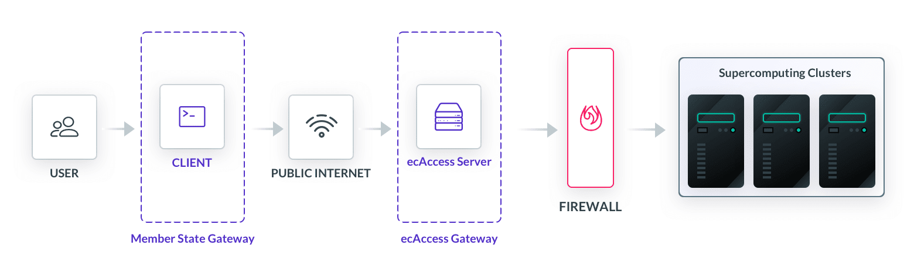
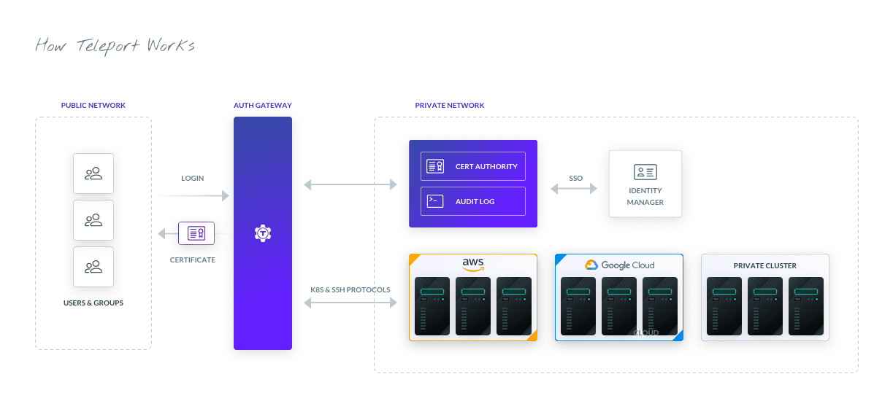
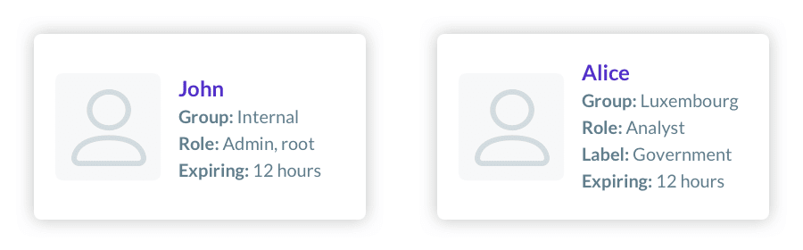
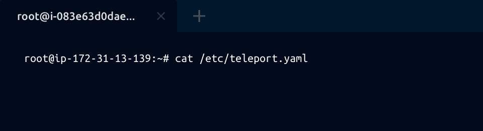

import {
  SectionHeader,
  Section,
  Box,
  Link,
  Flex,
  TryTeleport,
  Feedback,
  Quote,
} from "components";
import { Centrator } from "components/Layout";
import NextImage from "next/image";

<SectionHeader
  mode={meta.layout}
  subtitle="Customer Case Study"
  title="How Third Parties Securely Access Supercomputing Clusters"
  bg="wave-on-gray"
>
  <NextImage
    src="./assets/ecmwf.png"
    width={300}
    height={52}
    layout="intrinsic"
    alt="logo ECMWF"
  />
</SectionHeader>
<Section
  bg="wavelight"
  color="darkest"
  backgroundPosition="top left"
  backgroundSize="auto"
>
  <Centrator mt={11} mb={8} flexDirection="column">
    The ECMWF needs to safely and securely grant remote shell access to a supercomputer while knowing little about the end users. So when they modernized, European Centre for Medium-Range Weather Forecasting (ECMWF) chose Teleport. On one hand, the ECMWF was founded to provide mission-critical weather services to its members across Europe. On the other, they had to protect computing clusters that forecast models from unwanted access. The catch? A healthy portion of their ecosystem consisted of third party users connecting remotely from a Member State. In other words, the ECMWF had to open their facilities to researchers they did not have explicit contracts with and cannot know in advance. With Teleport, they have enough control to feel comfortable exposing endpoints to anyone its Member States had authorized.

    <Quote mt={6}>
      <Box as="p" fontWeight="700">About <Link scheme="site" color="dark-purple" href="https://www.ecmwf.int/">ECMWF</Link></Box>

      <Box as="p" fontWeight="400">The European Centre for Medium-Range Weather Forecasting is an independent organization, supported by participating Member States. Hosting one of the largest supercomputing facilities and meteorological data stores in the world, the ECMWF provides invaluable forecasting predictions and reporting. The organization is a key component of Europe’s meteorological infrastructure, working with various national weather services to inform weather conditions for seaports, natural disasters, airports, and space agencies. For nearly 50 years, the ECMWF has remained Europe’s foremost pooling of meteorological resources.</Box>
    </Quote>

    <Box as="h2" mt={11} mb={2} text="header-2" color="dark-purple">
      Preparing for Growth
    </Box>
    The ECMWF’s 10-year goals, set in 2016, had ambitious mandates; one of which required moving their datacenter from Reading, England to Bologna, Italy. The relocation was a massive undertaking, requiring multinational collaboration to move and construct a state-of-the-art data center in a 9,000 square meter facility. The infrastructure team at the ECMWF would use this opportunity to refurbish outdated services, one of which included a remote access service for members that needed to connect a shell to ECMWF’s computing powerhouse.

    As with most growing organizations, the ECMWF’s existing in-house solution, ecAccess, became difficult to maintain under the weight of demands it was not built to hold. Design choices from a decade ago prevented the adoption of new technologies and steepened the learning curve with each additional user. To achieve the goals set in the Roadmap to 2025 initiative, the infrastructure team would go on to uproot ecAccess and transplant it with a modern remote access tool. One that would improve security and provide greater visibility.

    <Box as="h2" mt={5} mb={2} text="header-2" color="dark-purple">
      What is ecAccess?
    </Box>
    The two computational behemoths housed by the ECMWF include a high-performance computing Linux cluster and two <Link scheme="site" color="dark-purple" href="https://en.wikipedia.org/wiki/Cray_XC40">Cray XC40s</Link> that constitute its supercomputer. Capable of up to hundreds of teraflops in processing power, these facilities are used by researchers to crunch data and build machine learning models all through remote shell access via SSH. Such low-level access opened an avenue for hackers to siphon supercomputing resources, with a recent example being a coordinated attempt to use other European supercomputers to <Link scheme="site" color="dark-purple" href="https://www.zdnet.com/article/supercomputers-hacked-across-europe-to-mine-cryptocurrency/">mine cryptocurrencies</Link>. For the ECMWF, the stakes are higher as their systems directly support emergency services. Days or even weeks of downtime is not tolerable.

    <Figure
      xMargin={0}
      width={1208}
      height={372}
      caption="Figure 1: ecAccess Architecture"
    >
      
    </Figure>

    <Box as="h2" mt={5} mb={2} text="header-2" color="dark-purple">
      Servicing the Ecosystem
    </Box>
    The ECMWF’s user base includes two very different groups. Those with the most privileges included staff, such as analysts and sysadmins. The bulk of users were granted access by the ECMWF’s Member States; a revolving door of scientists and researchers from universities, public utilities, and federal agencies all across Europe. This meant the ECMWF had little control over where a client machine was located, what software it ran, and who sat on the other end.

    Gating access with these limitations proved to be quite difficult. Paradoxically, upgrading security measures had the potential to weaken the ECMWF. For example, SSH keys are superior to password-based authentication for a  <Link scheme="site" color="dark-purple" href="https://lwn.net/Articles/369703/">variety of reasons</Link>, but issuing SSH keys was never a viable option for the ECMWF. Keys would have to be distributed to a changing user base with little control over what happens to them. Despite being a better method of primary authentication, leaving keys across thousands of local machines meant researchers could access supercomputers even after they’ve left the organization.

    Like most Linux shops, especially one that creates and freely distributes software themself, the staff at ECMWF had a healthy appreciation for open-source software. So when they first came across Teleport as a possible fit, they immediately went to the Github repo.
    <Feedback reviews={meta.reviews} />

    <Box as="h2" mt={5} mb={2} text="header-2" color="dark-purple">
      An (Accelerated) Implementation
    </Box>

    The ECMWF first implemented Teleport in their facility in England, both as a POC and because of the immediate need for better auth. The idea was to have both ecAccess and Teleport in production and slowly wean users off ecAccess in preparation for their Italy data center, which would only support Teleport. In March 2020, this initiative was pushed into high gear as COVID spread.

    <Figure
      xMargin={0}
      width={1208}
      height={554}
      caption="Figure 2: How Teleport Works"
    >
      
    </Figure>

    <Box as="h2" mt={5} mb={2} text="header-2" color="dark-purple">
      Session-based Logins
    </Box>
    The most powerful among SSH authentication methods, certificates provide strong security but are notoriously difficult to implement. Teleport helps the ECMWF configure a <Link scheme="site" color="dark-purple" href="/teleport/how-it-works/certificate-based-authentication-ssh-kubernetes/">certificate authority</Link> out of the box without having to manage any keys stored on local machines. An encoded time-to-live meant that the ECMWF could track individual sessions that would eventually expire, leaving any locally stored certificates completely useless. Prior to Teleport, users would have to reauthenticate upon every connection, making the experience extremely cumbersome.

    The ECMWF now also had granular visibility into who was in their data center and what they were doing. With session-based logins, Teleport would record events, leaving a log of security critical events as well as a full recording of the session.

    <Box as="h2" mt={5} mb={2} text="header-2" color="dark-purple">
      Role Based Access Control (RBAC)
    </Box>
    ECMWF connected Teleport to their identity management system and Keycloak login service (a popular open source tool) with multi-factor authentication. No longer were users just a one-dimensional UID. They were now identifiable with traits like name, team, role, and groups. This level of detail could only be achieved by a pipeline feeding identity information with each session request.

    Consider two potential certificates an authorization server may receive:

    <Figure
      xMargin={0}
      width={600}
      height={177}
      caption="Figure 3: Two Different User Identities"
      imagePositioning="center"
    >
        
    </Figure>

    Both John and Alice present notably different profiles. John is a staff member and a sysadmin at that. His privilege level is superior to Alice’s, who received credentials through a Member State government program. With Teleport, the ECMWF could partition different levels of authorization, enforcing access policies among staff, analysts, and third parties. A YAML file for John’s admin role may look something like this:

    ```
      kind: role
      version: v3
      metadata:
        name: admin
      spec:
        # SSH options used for user sessions
          max_session_ttl: 4h
          forward_agent: true
          port_forwarding: true
          client_idle_timeout: never
          disconnect_expired_cert: no
        # allow section declares a list of resource/verb combinations
        allow:
          # logins array defines the OS/UNIX logins a user is allowed to use.
          logins: [root]
          # list of node labels a user will be allowed to connect to:
          node_labels:
            # a user can only connect to a node marked with all labels:
            'environment': '*'
    ```

    <Box as="p" my={3}>
      Whereas Alice’s may look like:
    </Box>

    ```
      kind: role
      version: v3
      metadata:
        name: Analyst
      spec:
          max_session_ttl: 4h
          forward_agent: true
          port_forwarding: true
          client_idle_timeout:600
          disconnect_expired_cert: no
        allow:
          logins: [ec2-user]
          node_labels:
            'environment': 'staging'
    ```

    <Box as="p" mt={3}>
      By connecting the user login with an identity provider, identity information gets propagated to restrict activity, enforce logins, and control sessions.
    </Box>

    <Box as="h2" mt={5} mb={2} text="header-2" color="dark-purple">
      The Web UI
    </Box>
    In addition to a local agent, Teleport provides a fully featured web-based SSH console that can be used in-browser. This unlocked an entirely new cast of users that existed solely over the web. The demographic included people that had only used Windows machines and might still be using one. For example some security policies prevent users from downloading any agents on local devices, either for OpenSSH or Teleport. Others just found using the CLI daunting. For all these people, having a web client gave them a channel they previously had not.

    <Figure
      xMargin={0}
      width={600}
      height={164}
      caption="Figure 4: Teleport Web Console"
      imagePositioning="center"
    >
      
    </Figure>

    Even for those experienced with Linux, the Web UI has been a welcome addition to the ECMWF. A widely adopted OSS data science tool, JupyterHub, exists in-browser. By being able to hop between services by just switching tabs makes for a much more consistent experience for many data scientists.

    <Box as="h2" mt={5} mb={2} text="header-2" color="dark-purple">
      Looking Ahead
    </Box>
    In 1975, the ECMWF embarked on a grand expedition; to foretell the weather with great accuracy. Their move to Italy marked the latest milestone. Committing to lofty goals for 2025, the ECMWF had to put more on the line. More compute. More people. More predictions. More access. Particularly, shell access to the most powerful computers in the world across an ever-changing base of users.

    And yet still, despite an accelerated implementation, the ECMWF was met with overwhelmingly positive feedback.

    <Flex flexDirection="column" alignItems="center" width="100%" my={3}>
      <NextImage
        src="./assets/ecmwf-comments.png"
        width={600}
        height={207}
        layout="intrinsic"
        alt="positive feedback"
      />

    <Box mt={3}>
      <Link scheme="site" color="dark-purple" href="https://confluence.ecmwf.int/display/UDOC/Teleport+SSH+Access">Source</Link>
    </Box>
    </Flex>

  </Centrator>
</Section>
<SectionHeader
  mode={meta.layout}
  subtitle="Teleport is part of the"
  title="Access Plane"
  description="Teleport provides an Access Plane that consolidates access controls and auditing across all environments - infrastructure, applications and data."
  bg="wave"
  link={meta.accessLink}
>
  <NextImage
    src="./assets/access-plane-all.png"
    width={588}
    height={356}
    layout="intrinsic"
    alt="Teleport Access Plane"
  />
</SectionHeader>
<TryTeleport />
